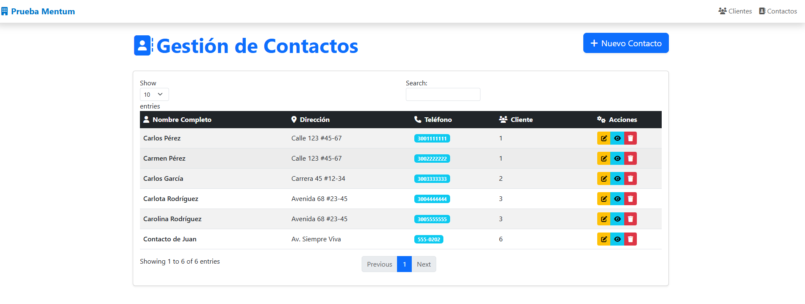

# Prueba Técnica Momentum - ASP.NET

El repositorio incluye: 
- Código del proyecto MVC en ASP.NET
- Querys de inicialización para las tablas
- Diagrama entidad-relación
- Sentencias SQL

Además de un archivo docker-compose que tiene configurado un contenedor con sql server

## Descipción

Aplicación web ASP.NET Core MVC para la administración de clientes y sus contactos.

## Requisitos
- .NET 10.0 SDK
- Docker Engine

## Tecnologías

- ASP.NET Core 10.0 MVC
- Entity Framework Core
- SQL Server
- Bootstrap 5 + DataTables + Font Awseome

## Instalación y Configuración

### 1. Clonar el repositorio
```bash
git clone https://github.com/cmolina-dev/mentum-prueba-tecnica.git
cd mentum-prueba-tecnica
```

### 2. Configurar la base de datos

-  Levantar el contenedor con SqlServer 
```bash
docker-compose up -d
```
- Crear la base de datos manualmente

```
db/init.sql
```
### 3. Restaurar paquetes y ejectuar

```bash
# restaurar librerias frontend
libman restore

# Restaurar y compilar
dotnet build

# Ejecutar
dotnet run
```

## Estructura del Proyecto

```
WebApp/
├── Controllers/        # Controladores MVC y API
|   ├── Api/
|   |    ├── ClientesController.cs
|   |    ├── ContactosController.cs 
│   ├── ClientesController.cs 
│   └── ContactosController.cs 
├── Models/            # Modelos de datos
│   ├── Cliente.cs
│   └── Contacto.cs
├── Views/             # Vistas Razor
│   ├── Clientes/
│   └── Contactos/
├── Services/          # Capa de servicios (lógica de negocio)
├── DTOs/              # Objetos de transferencia
└── Data/              # DbContext
```
## Funcionalidades Implementadas

### Aplicación Web
- CRUD Clientes
- CRUD Contactos
- Búsqueda y filtros (DataTables)
- Ordenamiento por columnas
- Paginación
- Diseño responsive
- Relación Cliente-Contactos (1 a muchos)

### Web Service REST
- Endpoint para crear contactos
- Validación de cliente existente
- Respuestas estructuradas

### Base de Datos
- Diagrama Entidad-Relación (Ver `diagrama_entidad_relacion.png`)
- Sentencias SQL (Ver `sentencias.txt`)

## Diseño y Usabilidad

- Interfaz moderna con Bootstrap 5
- Tablas interactivas con búsqueda en tiempo real
- Iconos intuitivos
- Diseño responsive

## Capturas 
